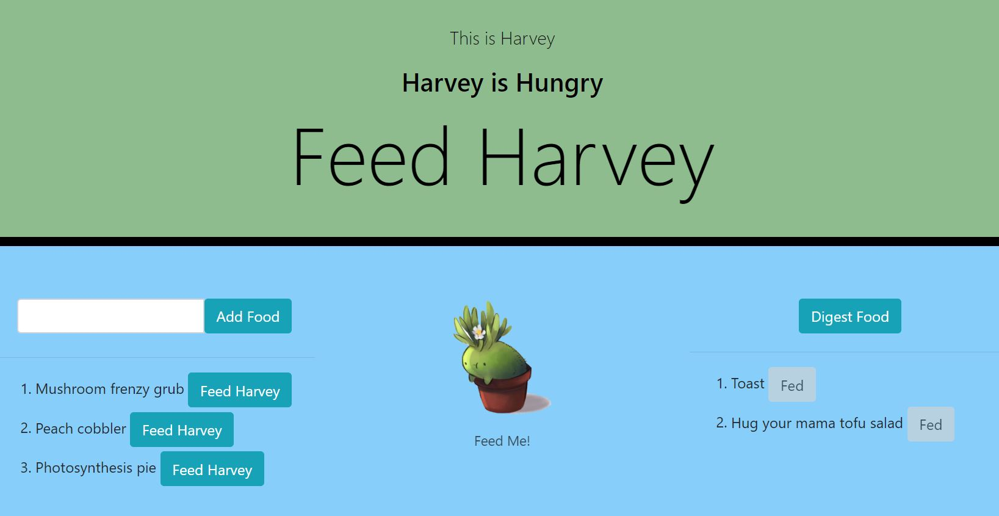

# feed-harvey-food-logger-scd-hw12
This is a Git Hub repository for the NU Coding Bootcamp Burger Logger with MySQL, Node, Express, Handlebars, ORM Homework for Week 13.





# Deployed Application Link
*enter heroku link


# Setup

1. Once logged in with [GitHub account](https://github.login/), clone the repo locally using link:

  ```sh
    git clone https://github.com/gideonrynn/teampacr-profile-generator-hw7.git
  ```

2. Install dependencies:
```sh
  npm i
```

3. Load feedharvey-schema and update password in connection file. 

    (Optional) To test with seed file, load feedharvey-seed from /db folder and follow instructions. 

4. Run in command line with node server.js


Also see: [Cloning a repository](https://help.github.com/en/github/creating-cloning-and-archiving-repositories/cloning-a-repository).


# Usage

The Feed Harvey app is a plant-feeding app that uses node, handlebars, express and mysql. It allows users to add food to the site and click a button to indicate the food they entered has been eaten by the plant. All food - devoured or not - will be stored in a sql database.

Application can initiated in the command line. For this example, Heroku is used the run the application in the browser.


# Technologies

This project was built using:

  - Node
  - [Express ^4.17.1](https://www.npmjs.com/package/express)
  - [Express-Handlebars ^3.1.0](https://www.npmjs.com/package/express-handlebars)
  - [MySQL ^2.18.1](https://www.npmjs.com/package/mysql)
  


# License

This project uses the MIT License. See the full details here: https://choosealicense.com/licenses/mit/ 
